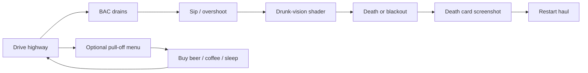
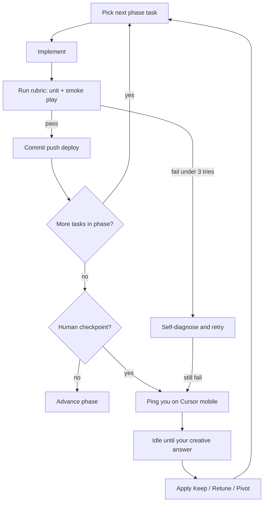

---
todos:
  - id: repo-scaffold
    status: in_progress
    content: Create isolated alcohaulic repo (Vite/TS/Three/Vercel) + SPRINT.md queue + meter test harness + AGENTS.md glossary
  - id: phase-a-greybox
    content: 'Ship greybox truck, procedural highway, chase cam, arcade physics with steeringLag, fog/night, live Vercel link'
    status: pending
  - id: phase-b-pocket
    content: 'Implement BAC+alertness pocket, items, drunk-vision v1, withdrawal/blackout fails, dispatch miles quota; run kill-gate self-assess'
    status: pending
  - id: human-kill-gate
    content: Ping user for Keep/Retune/Pivot on pocket feel before any more systems
    status: pending
  - id: phase-c-clips
    content: 'Death cards, hallucinated deer, radio chatter, title screen, in-run tolerance nudge'
    status: pending
  - id: phase-d-pulloff
    content: 'UI pull-off stop (buy/sleep), restart loop, 3–6 min balance'
    status: pending
  - id: human-tone-ship
    content: Ping user for tone copy approval + public vs gated ship decision
    status: pending
  - id: phase-e-ship
    content: 'Perf pass, how-to-play, clip setups, public demo URL'
    status: pending
name: Alcohaulic Week Sprint
overview: 'Compress ALCOHAULIC from a 12-week demo into a 5-day shippable browser slice: driving + BAC pocket + drunk-vision + death clips. Cloud agents run an automated build/self-assess loop; you only answer creative checkpoints on your phone.'
isProject: false
---
# ALCOHAULIC — One-Week Cloud Sprint Plan

## What we are protecting

The original plan’s inversion stays sacred: **every other game punishes drinking; this one punishes sobering up.** If a cut removes pressure on the “pocket,” it is the wrong cut.

Everything else from the 12-week plan is negotiable.

## Success definition (end of ~5 working days)

A public Vercel link where a stranger can, in under 3 minutes:

1. Drive a low-poly rig on a foggy night highway (chase cam).
2. Watch BAC drain in real time and feel steering change with BAC.
3. Sip to stay above the withdrawal floor; overshoot into blackout/drunk fail.
4. Die of sobriety (or crash) and get a screenshot-ready death card: **"DIED OF SOBRIETY — Mile N."**
5. Restart a short run (1 haul, not a 3–5 haul chain).

If that loop isn’t *fun* by the mid-sprint kill gate, we redesign the pocket — we do **not** build stops, cops, or meta.

## Explicit cuts (not in v0)

| Cut from original | Why |
|---|---|
| Explorable stop hubs (bars, strip clubs, motels as 3D scenes) | Highest scope; replace with 1 menu “pull-off” sheet |
| Dealer negotiate / fake-pill / contacts book | Roguelike variety engine — post-demo |
| Heat, patrol AI, DUI checkpoints, weigh stations, bribes | Whole Phase 3 — post-demo |
| Cross-run tolerance + rig upgrades | Keep **in-run** tolerance only (pocket shrinks during the haul) |
| Contract soundtrack / Steam page / Twitch chat | Marketing phase after playable core |
| WebGPU-only flex | Three.js **WebGLRenderer** first; WebGPU later if free |
| Tauri / Steam wrapper | Phase 2 unchanged, not this week |

## What ships in the week (vertical slice)

**Systems kept (minimum that still feels like the game):**

- **BAC** (floor = withdrawal death; ceiling = blackout → wake with cargo damage / late / soft fail)
- **Alertness** (miles + night → micro-sleep screen dip → crash risk) — one secondary meter only
- **Job standing** — simplified: on-time miles quota for one dispatch load
- **Drunk-vision post-process** tied to BAC (wobble, double ghost, vignette, tremor below floor) — visual identity
- **Arcade truck physics** with `steeringLag` driven by BAC (make-or-break dial)
- **Procedural highway chunks** + fog + day/night (night-heavy default)
- **In-cab radio** — placeholder loop + 8–12 lines of dispatch/dark-comedy chatter (TTS or canned samples; no $500 soundtrack yet)
- **Death cards** engineered for clips
- **Pull-off** as a full-screen UI encounter (gas / beer / coffee / sleep), not a 3D hub

**Meters deferred:** Morale, Heat (swerve can just risk crash; no cops).

## Stack & repo

- **New isolated project** (not inside the senior-care directory app). Default: new GitHub repo `alcohaulic`, Vite + TypeScript + Three.js, deploy on every push to Vercel.
- Conventions from original §5 kept: one system per file, meters as pure functions, `CLAUDE.md` / `AGENTS.md` with systems glossary + this sprint’s acceptance rubrics.
- If we must bootstrap from the current cloud workspace first, scaffold under a throwaway path only long enough to push to the new repo — **never merge game code into the care-directory `main`.**

## Five-day execution map

Not calendar estimates for you — phase gates for the agent loop. Each phase ends only when its self-assessment rubric passes or a human checkpoint fires.

### Phase A — Greybox drive (must be live link)

- Vite/TS/Three scaffold, Vercel deploy from day one
- Truck mesh (placeholder low-poly), infinite/procedural highway, chase cam
- Arcade physics v0 with exposed `steeringLag`
- Fog + night look

**Self-assess:** 60s drive without falling through world; 30+ FPS on a mid laptop; link loads cold in browser.

### Phase B — The pocket (kill gate)

- BAC + Alertness meters (pure functions + UI)
- Drink / coffee / upper items (cab inventory, 3 item types max)
- BAC → `steeringLag` + drunk-vision v1
- Withdrawal death + blackout soft-fail
- Dispatch: “haul X miles by dawn” quota

**Self-assess (automated + agent playthrough notes):**

- Can stay in pocket for ≥90s with intentional sipping
- Ignoring drinks → withdrawal death within a clear, readable spiral
- Max drunk → visibly worse control (not just UI numbers)
- Agent records a 20–40s clip-worthy moment description for you

**HUMAN CHECKPOINT 1 — Kill gate:** You play the link (phone or laptop). Answer only: *Keep / Retune pocket / Pivot feel.* No feature requests unless the pocket is dead.

### Phase C — Clip juice

- Death card art/copy pass (“DIED OF SOBRIETY”, “BLACKED OUT — Mile N”, crash variants)
- Hallucinated deer when below floor (cheap billboard + scare)
- Radio chatter pack (dispatch roasting you)
- Title screen + one-button “Start haul”
- Light in-run tolerance: each drink raises floor slightly during the run

**Self-assess:** Every fail state produces a distinct, readable death card; 3 fail paths reachable without cheats.

### Phase D — Fake “night stop” + restart loop

- Pull-off menu at mile markers / when alertness critical
- Buy beer/liquor/coffee; sleep (restores alertness, **drains BAC toward floor** — keep the 4am dread)
- Run end → meta screen that only says stats + Restart (no persistent tolerance yet)
- Balance pass so a competent first run lasts 3–6 minutes

**HUMAN CHECKPOINT 2 — Tone:** Approve/reject 10–15 lines of dispatch + death copy. You are the satire editor; agent does not ship lines you flag.

### Phase E — Ship slice

- Perf pass (draw distance, fog, poly budget)
- Mobile *play* not required; layout must not be broken if opened on phone for you to review
- Public demo link + 5-bullet “how to play”
- Devlog assets: 3 clip setups (withdrawal deer, blackout, death card)

**HUMAN CHECKPOINT 3 — Public or gated:** Ship public Vercel URL vs password/gated rough build.

## Automated agent loop (you out of the technical loop)

**How the cloud agent runs without you:**

1. **Task queue** in repo (`SPRINT.md` or `docs/sprint-queue.md`): ordered, checkboxed, each with a pass/fail rubric.
2. **Pure meter tests** (`vitest`): BAC drain, pocket bounds, sleep drains BAC, tolerance floor nudge — CI-able, no GPU needed.
3. **Smoke checklist** the agent runs manually each loop: load deploy URL, drive 60s, force withdrawal, force blackout, confirm death card.
4. **Self-assessment writeback:** after each phase, agent appends `logs/phase-N-assessment.md` (what passed, FPS notes, fun judgment, risks).
5. **Stop conditions → ping you:** kill gate, tone copy, public-vs-gated, or any rubric failed 3 times / architectural fork (e.g. “physics feel dead, propose steering model B”).
6. **Phone pings:** Cursor cloud agent notifications when status is waiting on you — questions are **one screen max**, multiple choice preferred (`Keep / Retune X / Pivot to Y`).

**Your job this week:** answer 3 checkpoints + occasional retune votes. Not tickets, not code review, not asset hunting unless you want to.

## Creative direction defaults (so we don’t block)

Unless you override at Checkpoint 1/2:

- Aesthetic: night-highway PS1, teal sodium lights, heavy fog, chase cam — no UI chrome that looks like a sim dashboard
- Tone: dark comedy; victims never joked; crashes punish *you*
- Controls: keyboard + optional gamepad; click-to-play mute/unmute for radio
- First haul length target: 3–6 minutes to first death for a new player who experiments

## Mapping to original 12-week phases

| Original | This sprint |
|---|---|
| Phase 0 greybox (wk 1–2) | Phase A (hours, not weeks) |
| Phase 1 pocket (wk 3–4) | Phase B + kill gate |
| Phase 2 night hubs (wk 5–7) | Phase D menu pull-off only |
| Phase 3 law (wk 8–9) | Cut |
| Phase 4 juice (wk 10–12) | Phase C+E, soundtrack deferred |
| Steam / viral / Twitch | After link exists; build-in-public clips from Phase C |

## Risks (compressed)

- **Driving feel mid** → kill gate still exists; steeringLag prototype is task #1 after camera, not “later.”
- **Meter juggling boring without stops** → variety from radio + deer + pull-off dread + death cards; if still flat at kill gate, retune pocket physics before adding systems.
- **3D scope creep** → hard cap: highway chunks + truck + deer billboard + UI. No walking.
- **This monorepo trap** → new repo; do not ship inside the care directory product.

## Immediate next step after you approve this plan

1. Confirm/create empty `alcohaulic` GitHub repo (or tell agent to use a name you prefer).
2. Agent scaffolds Phase A, deploys, pings you with the first greybox link + Checkpoint 0 vibe check (“night highway feel: yes / colder / more liminal”).
3. Autonomous loop through Phase B → your Kill Gate on phone.
